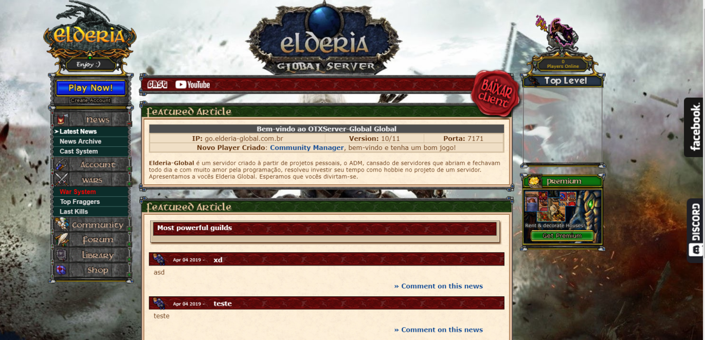
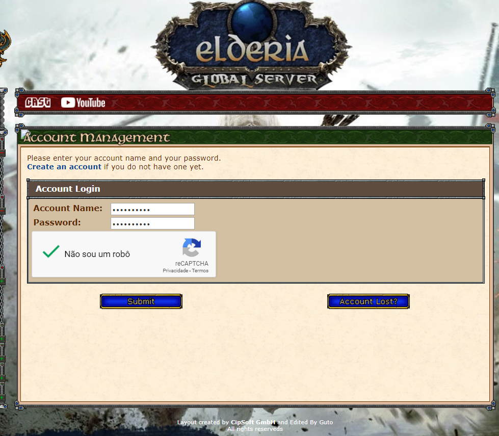
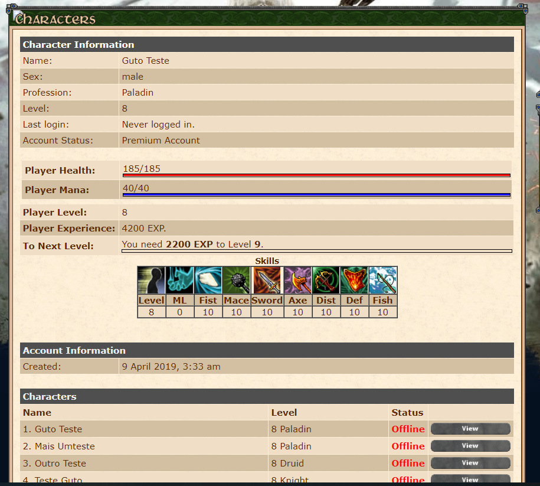
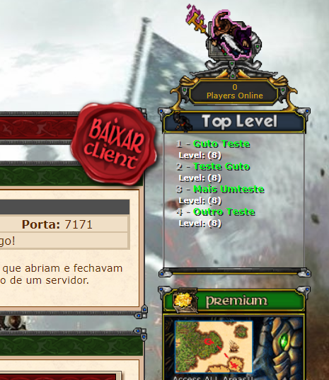

# LEIA COM ATENÇÃO - INTEGRAÇÃO PAGSEGURO
```
1) Arquivo config.php
Configurar esses três campos
$config['pagseguro']['email']
$config['pagseguro']['token']
$config['pagseguro']['tokentest']

2) Arquivo retorno.php
Configurar
$email = 'SEU EMAIL DE CADASTRO NO PAGSEGURO'
$token = 'SEU TOKEN LIBERADO NA API DO PAGSEGURO'
$url = 'No momento deixei fixa a da sandbox, trocar pelo main frame (gateway principal) depois de testar
Se esses dados não "baterem" você NÃO VAI CONSEGUIR TROCAR INFORMAÇÕES COM O PAGSEGURO

3) Arquivo retpagseguro.php
Configurar os dados do banco de dados
$servername = "127.0.0.1";
$username = "root";
$password = "";
$dbname = "gesior";
Esse arquivo "lê" as respostas das notificações que o pagseguro envia e de acordo com a mensagem (aprovada ou não) ele insere os coins direto na conta na tabela pagseguro_transactions.

# Elderia-Online-Gesior-Website
<p align="center"></p>

<p align="center"></p>

<p align="center"></p>

<p align="center"></p>


